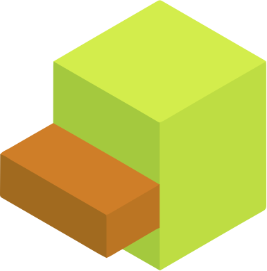

# DuckDuckCode 

This project was developed in JavaScript for the course CMC-30: Computer Graphics at ITA (Instituto Tecnológico de Aeronáutica, Brazil). DuckDuckCode is a 3D world in which users can input "code" in an intuitive way, with the aim of teaching beginners some fundamentals of programming. It was developed by two ITA students: Bernardo Hoffmann ([`@BerHoffmann`](https://github.com/BerHoffmann)) and Emmanuel Dias ([`@emmanuelsdias`](https://github.com/emmanuelsdias)).

In DuckDuckGo you control a Duck, which needs to rescue all the lost Ducklings. To do so, you will need to control the Duck's movement using code blocks, each representing an action, a loop or a conditional. The Duck will then execute the code, moving around the world and rescuing the Ducklings. The game is divided into levels, each one with a different challenge. It was heavily inspired by Google's _Celebrating 50 years of Kids Coding_ [Doodle](https://g.co/doodle/ygxau2).

## How to Play

Currently, DuckDuckCode is still in development, however you can [play the most recent version here](https://emmanuelsdias.github.io/duck-duck-code/). Note that there are still some bugs to be fixed and some features to be added. Also, currently the movement is controled by the arrow keys (or swipes if in mobile), but the final version will use the code blocks.
